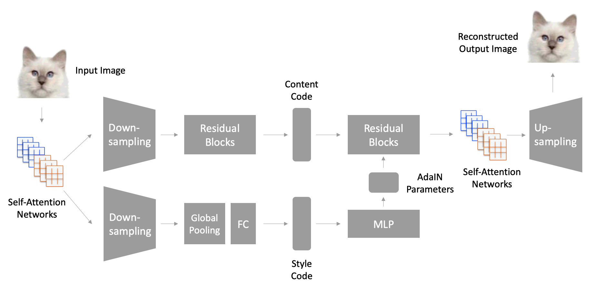
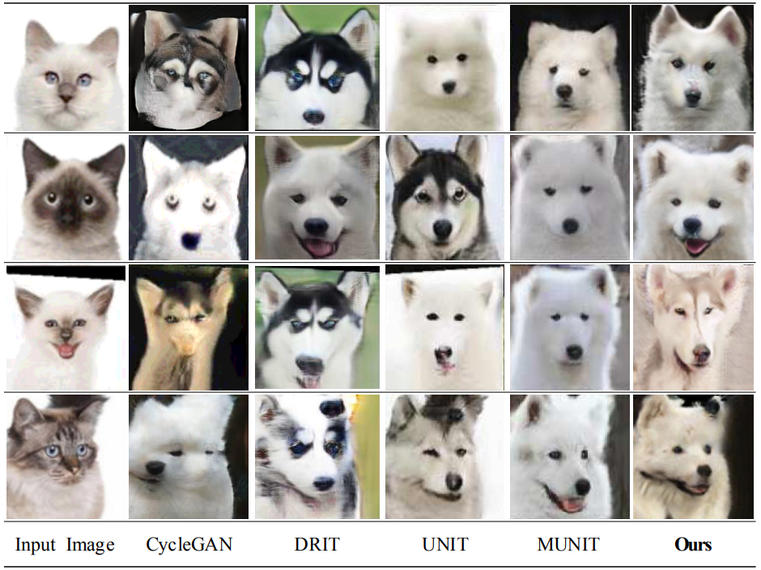
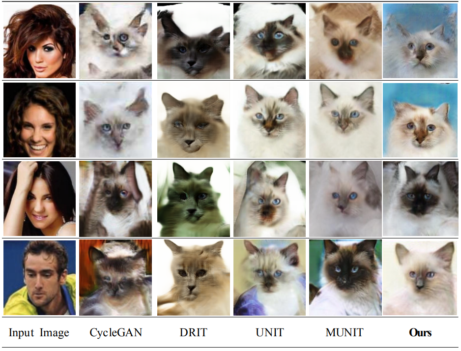
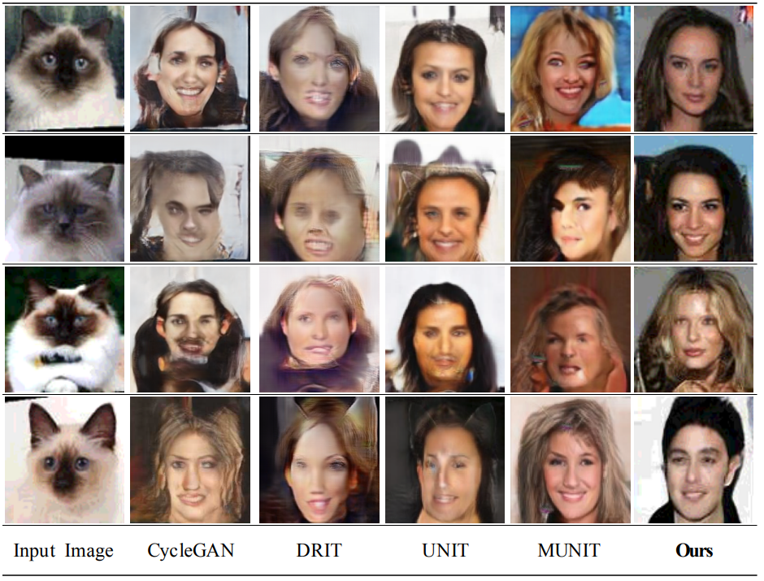
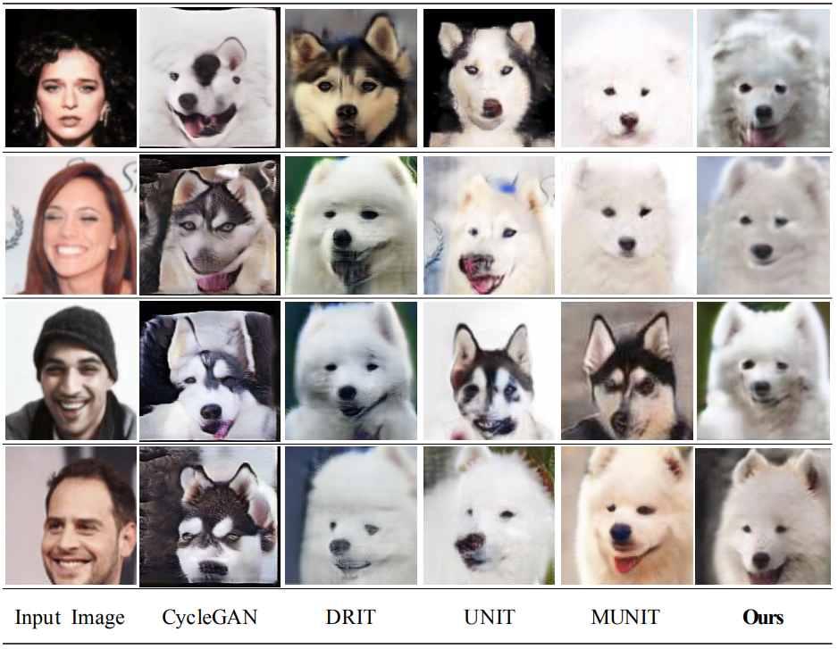

# Unsupervised Image-to-Image Translation with Self-Attention Networks

## This paper has been accepted as a REGULAR paper presented at [IEEE International Conference on BigComp 2020.](http://itsc.kr/2020/02/22/ieee-bigcomp-2020-unsupervised-img2img-sa-presentation/)

This is the official PyTorch implementation of [Unsupervised Image-to-Image Translation with Self-Attention Networks](https://arxiv.org/abs/1901.08242).

> **Unsupervised Image-to-Image Translation with Self-Attention Networks** 
> Taewon Kang(Sejong Academy of Science and Arts), Kwang Hee Lee(Boeing Korea Engineering and Technology Center) 
> 2018.03. - 2019.09.
>
> **Abstract:** *Unsupervised image translation aims to learn the transformation from a source domain to another target domain given unpaired training data. Several state-of-the-art works have yielded impressive results in the GANs-based unsupervised image-to-image translation. It fails to capture strong geometric or structural changes between domains, or it produces unsatisfactory result for complex scenes, compared to local texture mapping tasks such as style transfer. Recently, SAGAN (Han Zhang, 2018) showed that the self-attention network produces better results than the convolution-based GAN. However, the effectiveness of the self-attention network in unsupervised image-to-image translation tasks have not been verified. In this paper, we propose an unsupervised image-to-image translation with self-attention networks, in which long range dependency helps to not only capture strong geometric change but also generate details using cues from all feature locations. In experiments, we qualitatively and quantitatively show superiority of the proposed method compared to existing state-of-the-art unsupervised image-to-image translation task.*

Contact: Taewon Kang (itschool@itsc.kr) and Kwang Hee Lee (kwanghee.lee2@boeing.com)

## Paper
[Taewon Kang](http://itsc.kr), [Kwang Hee Lee](), "[Unsupervised Image-to-Image Translation with Self-Attention Networks](https://arxiv.org/abs/1901.08242)"

## Code Usage
### Training
    python train.py --config configs/YOUR_CONFIG_NAME.yaml

### Testing
    python test.py --config configs/YOUR_CONFIG_NAME.yaml --input inputs/input.jpg --output_folder outputs --checkpoint models/YOUR_DATASET_NAME.pt --a2b 1

## Architecture

## Results
### cat2dog

### img2cat

### cat2img

### img2dog

## Reference
A lot of code are adapted from online.
* [MUNIT](https://github.com/NVlabs/MUNIT)
* [Self Attention GAN](https://github.com/heykeetae/Self-Attention-GAN)
